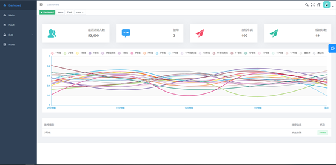

# 地铁信息管理系统

## 简介
该项目使用了Vue.js框架、Node.js后端、Express框架、MongoDB数据库、Redis数据库、LSTM机器学习模型算法等技术，实现了一个还算不错的地铁信息管理系统。

## 实现功能
* 地铁线路增删改查
* 使用Qunee组件进行地铁拓扑图可视化
* 路径规划
* 地铁列车实时位置监控以及可视化
* 地铁列车实时拥挤度监控
* 地铁人流量监控和可视化
* 使用LSTM机器学习算法进行地铁人流量预测

## 展示
### 主页

### 地铁拓扑图

### 人流量监控

### 路径规划

### 列车位置监控

### 人流量预测

