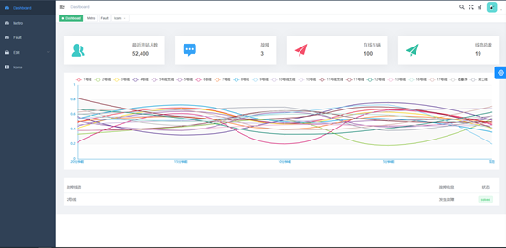
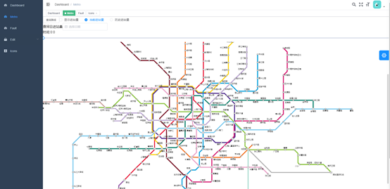
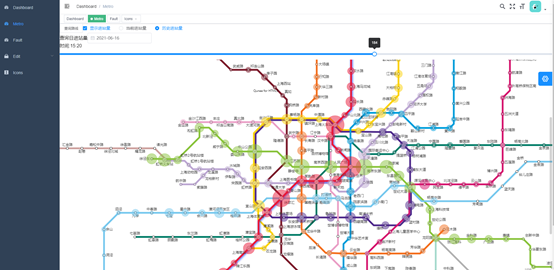
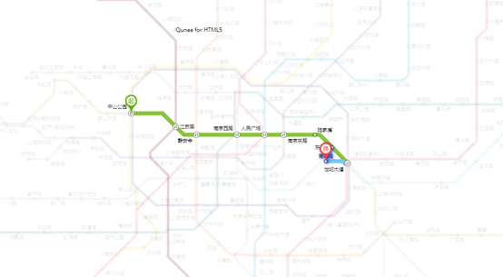
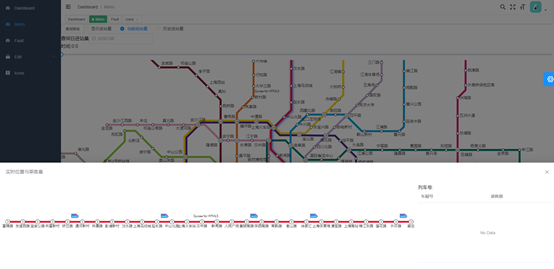
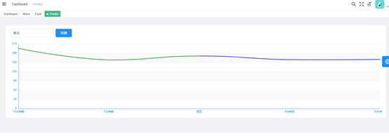

# 地铁信息管理系统

## 简介
该项目使用了Vue.js框架、Node.js后端、Express框架、MongoDB数据库、Redis数据库、LSTM机器学习模型算法等技术，实现了一个还算不错的地铁信息管理系统。

## 实现功能
* 地铁线路增删改查
* 使用Qunee组件进行地铁拓扑图可视化
* 路径规划
* 地铁列车实时位置监控以及可视化
* 地铁列车实时拥挤度监控
* 地铁人流量监控和可视化
* 使用LSTM机器学习算法进行地铁人流量预测

## 展示
### 主页
- 曲线表示各线路的当前负载

### 地铁拓扑图
- 使用qunee组件进行绘制，该组件是基于HTML5的canvas元素实现的拓扑图组件
- 智能拐点，在相邻站点之间判断是否需要拐点，使地铁图更加整齐美观

### 人流量监控
- 利用圆圈大小来监控过去5分钟的进站人流量

### 路径规划
- 采用dijkstra算法进行路径规划

### 列车位置监控
- 5分钟上报一次列车位置，在拓扑图中渲染显示

### 人流量预测
- 采用LSTM机器学习算法预测时序数据

